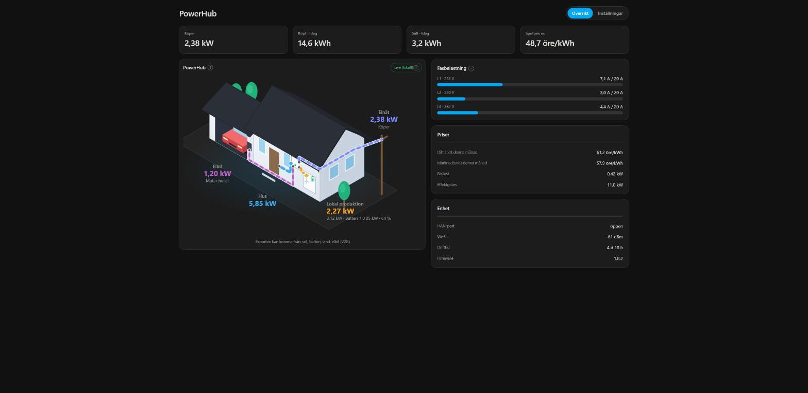

# ha-malarenergi-powerhub

Home Assistant custom integration for the **PowerHub** — the HAN-port energy monitor made by [Bitvis AB](https://bitvis.se/) and sold by Swedish energy companies:

| Energy company | Status |
|---|---|
| [Mälarenergi](https://www.malarenergi.se/el/elavtal/powerhub/) | Tested |
| Boo Energi | Confirmed working by a user |
| Bjäre Kraft, Borås Elhandel, Dala Energi, Falu Energi, Kinnekulle Energi, Kraftringen, Kvänum Energi, Landskrona Energi, Norrtälje Energi, Nossebro Energi, Skånska Energi, Södra Hallands Kraft, Tranås Energi, Trelleborgs Energi, Vaggeryds Energi, Vänerenergi, Varbergsortens Elkraft | Bitvis backend with BankID login exists; untested — please report! |

Another company not listed? Type its name in the setup dialog (lowercase, no spaces, å/ä/ö → a/a/o) and open an issue so it can be added.

## Works together with the built-in Bitvis Power Hub integration

Since **Home Assistant 2026.10** HA ships a [Bitvis Power Hub](https://www.home-assistant.io/integrations/bitvis) integration that reads the meter **locally** (UDP push on your LAN, no login). Use both:

| | Built-in `bitvis` (local) | This integration (cloud) |
|---|---|---|
| Real-time power, per-phase voltage/current, meter energy totals | ✅ best source — use for the Energy dashboard | 1-minute power and currents |
| Spot price, agreement, price model/zone | | ✅ |
| Monthly insights, year-to-date, baseload | | ✅ |
| Fuse/power limits, notification settings, sharing | | ✅ |

Both identify the hub by its MAC address, but HA keeps one device per integration, so the hub shows up as two devices — one local, one cloud. (On HA versions before 2026.8, if another integration such as a router's device tracker already claims the hub's MAC, the cloud device simply doesn't get the MAC.) The local integration needs the hub and HA on the same subnet (or UDP port 58220 and mDNS forwarded between them).

> **Status**: Working prototype — BankID auth + cloud API implemented.

## Hardware

| Property | Value |
|---|---|
| Manufacturer | Bitvis AB (OEM for the energy companies above) |
| SoC | Espressif ESP32 (OUI `94:54:C5`) |
| Connectivity | Wi-Fi 2.4 GHz |
| HAN port | RJ45 (Norwegian standard, P1/IEC 62056-21) |
| Meter | Kaifa MA304 |
| Cloud backend | Bitvis "Flow" platform — `<company>.prod.flow.bitv.is` |

The hub has no open TCP ports; it **pushes** meter readings over UDP on the LAN (what the built-in `bitvis` integration reads) and to Bitvis's cloud. This integration uses the same REST API as the energy companies' PowerHub apps.

## Support

If you find this integration useful, you can buy me a coffee ☕

[](https://www.buymeacoffee.com/jhara)

## Installation

### HACS (recommended)

[](https://my.home-assistant.io/redirect/hacs_repository/?owner=8408323&repository=ha-malarenergi-powerhub&category=integration)

Or manually:

1. In HACS, go to **Integrations → ⋮ → Custom repositories**.
2. Add `https://github.com/8408323/ha-malarenergi-powerhub` as an **Integration**.
3. Search for **PowerHub** and click **Download**.
4. Restart Home Assistant.

### Manual

1. Copy `custom_components/malarenergi_powerhub/` to your HA `config/custom_components/` directory.
2. Restart Home Assistant.

## Configuration

1. Go to **Settings → Devices & Services → Add Integration**.
2. Search for *PowerHub*.
3. Choose your energy company.
4. Scan the BankID QR code that appears with the BankID app.

See the **[full setup guide](docs/setup.md)** for step-by-step instructions with screenshots.

## Features

- HA Energy dashboard compatible import/export/spot-price sensors
- Real-time power and per-phase current (1-minute resolution)
- Monthly insights: your average price vs. market, year-to-date consumption and production, baseload estimate
- Device diagnostics: Wi-Fi signal, firmware, uptime, HAN port state
- Writable fuse/power limits and notification preferences
- Push notification mirroring (energy company → HA sensor)
- Facility sharing services (create / revoke invitations)
- Automatic token re-auth when JWT expires

See the **[user manual](docs/user_manual.md)** for the full entity list and usage.

## Dashboard panel

A **PowerHub** sidebar panel shows grid import/export as an animated house picture, phase load against the main
fuse, today's energy, prices and device status. If Home Assistant's built-in **Bitvis** integration is set up for
the same hub, the panel uses its local real-time values (badge "Live (local)"); otherwise the 1-minute cloud values.

The PowerHub only measures the grid connection, so it can't tell where exported power comes from. Under
**Settings** in the panel you tick your local sources (solar, home battery, wind, generator/CHP, EV with V2H/V2G,
other) and whether you have a plain EV charger. Production sources are drawn as one node with an icon each; a V2G
car can feed the house from the garage. Optionally pick a combined production-power sensor, battery sensors and an
EV power sensor so their values appear in the picture. The panel can be hidden from the sidebar there (it stays
reachable at `/powerhub`).



The panel source is in `frontend/` (React + Vite); `npm ci && npm run build` writes
`custom_components/malarenergi_powerhub/www/panel.js`, which is committed. `npm run dev` opens a preview with
synthetic data (`frontend/index.html` lists the URL flags).

## Authentication

Login uses **Swedish BankID** (same as your energy company's PowerHub app). During setup a QR code is displayed in the HA config flow — scan it with the BankID app on your phone.

The integration stores the JWT Bearer token in the HA config entry. When the token expires, HA triggers a re-auth flow automatically.

## Entities

The integration exposes ~40 entities — sensors, binary sensors, switches, numbers and selects. The full reference (entity IDs, units, writable controls, services) is in the [user manual](docs/user_manual.md).

## Development

### Requirements

```
pip install pytest pytest-asyncio aioresponses aiohttp
```

### Run tests

```bash
python3 -m pytest tests/ -v
```

### Traffic capture (for further reverse engineering)

```bash
# Install mitmproxy
pip install mitmproxy

# Start capture proxy (optionally filter by device/phone IP)
CAPTURE_PHONE_IP=192.168.1.x mitmdump -s tools/capture.py --listen-port 8080 --ssl-insecure
```

See [docs/reverse_engineering.md](docs/reverse_engineering.md) for full findings on the cloud API.

## Disclaimer

The cloud APIs are internal to Bitvis and not officially supported; they may change without notice. For guaranteed-stable meter data use the built-in `bitvis` integration.

## Contributing

Pull requests are welcome. Please open an issue first to discuss what you'd like to change.

## License

MIT
