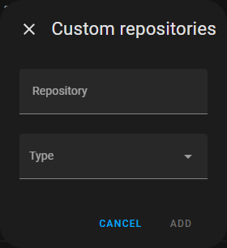
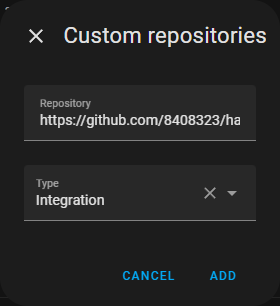

# Setup Guide — Mälarenergi PowerHub

This guide walks you through installing and configuring the Mälarenergi PowerHub integration in Home Assistant from scratch.

---

## What you need

- A Mälarenergi electricity subscription with a [PowerHub device](https://www.malarenergi.se/el/elavtal/powerhub/) installed at your property
- [HACS](https://hacs.xyz/) installed in Home Assistant
- The **BankID** app on your phone (same one used for Mälarenergi's own app)

---

## Step 1 — Add as a custom HACS repository

1. Open **HACS** in the Home Assistant sidebar
2. Click the **three-dot menu** (⋮) in the top right
3. Select **Custom repositories**

   

4. In the **Repository** field, enter:
   ```
   https://github.com/8408323/ha-malarenergi-powerhub
   ```
5. Set **Category** to `Integration`
6. Click **Add**

   

---

## Step 2 — Download the integration

1. In HACS, go to **Integrations**
2. Search for **Mälarenergi PowerHub**
3. Click the result to open the repository page
4. Click **Download** (bottom right)

   

5. Confirm by clicking **Download** in the dialog

---

## Step 3 — Restart Home Assistant

After downloading, Home Assistant must be restarted before the integration becomes available.

1. Go to **Settings → System**
2. Click the **power icon** (top right)
3. Select **Restart Home Assistant** → **Restart**

   

Wait ~30 seconds for Home Assistant to come back online.

---

## Step 4 — Add the integration

1. Go to **Settings → Devices & Services**
2. Click **+ Add integration** (bottom right)
3. Search for **Mälarenergi PowerHub**

   

4. Click the result — a setup dialog appears

---

## Step 5 — Scan the BankID QR code

The integration uses **Swedish BankID** for authentication — the same login as the Mälarenergi app.

A QR code is displayed in the dialog:


**To authenticate:**

1. Open the **BankID** app on your phone
2. Tap **Scan QR code** (or the QR icon)
3. Point your camera at the QR code on screen
4. **Approve** the login request in BankID

> **Note:** The QR code rotates every few seconds. If it expires before you scan it, click **Submit** in the dialog to get a fresh one.

---

## Step 6 — Done!

After a successful BankID login, three sensors are automatically created under your facility address:

| Entity | Description | Unit |
|---|---|---|
| `sensor.malarenergi_consumption_today` | Energy consumed today (midnight → now) | Wh |
| `sensor.malarenergi_production_today` | Energy produced today (solar/export) | Wh |
| `sensor.malarenergi_spot_price` | Current Nordpool spot price for your region | öre/kWh |


The sensors update every 60 seconds and are compatible with the **HA Energy dashboard**.

---

## Re-authentication

The JWT token issued by BankID expires after some time. When it does, Home Assistant will show a notification:

> *Mälarenergi PowerHub — re-authentication required*

Click the notification and follow the same BankID QR flow to renew your session.

---

## Troubleshooting

**The setup dialog appears blank (no QR code)**
Make sure you have the latest version installed. In HACS, go to the Mälarenergi PowerHub page → three-dot menu → **Update information**, then **Redownload**. Restart Home Assistant.

**BankID login fails or times out**
- Ensure your BankID is registered with the same personal identity number as your Mälarenergi account
- Close and reopen the BankID app and try again

**"No facilities found" error**
Your Mälarenergi account must have an active PowerHub device registered. Contact Mälarenergi if you believe this is incorrect.

**Sensors show 0 Wh**
This is expected early in the day (shortly after midnight) or if your PowerHub has not reported data yet. Values update as the day progresses.
