# Setup Guide — PowerHub

This guide walks you through installing and configuring the PowerHub integration in Home Assistant from scratch.

---

## What you need

- A PowerHub from your energy company (e.g. [Mälarenergi](https://www.malarenergi.se/el/elavtal/powerhub/), Kraftringen, Boo Energi — see the README for the full list) installed at your property
- [HACS](https://hacs.xyz/) installed in Home Assistant
- The **BankID** app on your phone (same one used for your energy company's app)

---

## Step 1 — Add as a custom HACS repository

1. Open **HACS** in the Home Assistant sidebar
2. Click the **three-dot menu** (⋮) in the top right
3. Select **Custom repositories**

   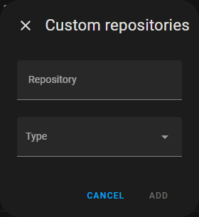

4. In the **Repository** field, enter:
   ```
   https://github.com/8408323/ha-powerhub-cloud
   ```
5. Set **Category** to `Integration`
6. Click **Add**

   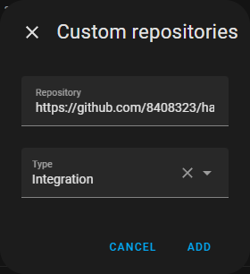

---

## Step 2 — Find the repository in HACS

Back in the HACS dashboard, search for **PowerHub** to locate the newly added repository.

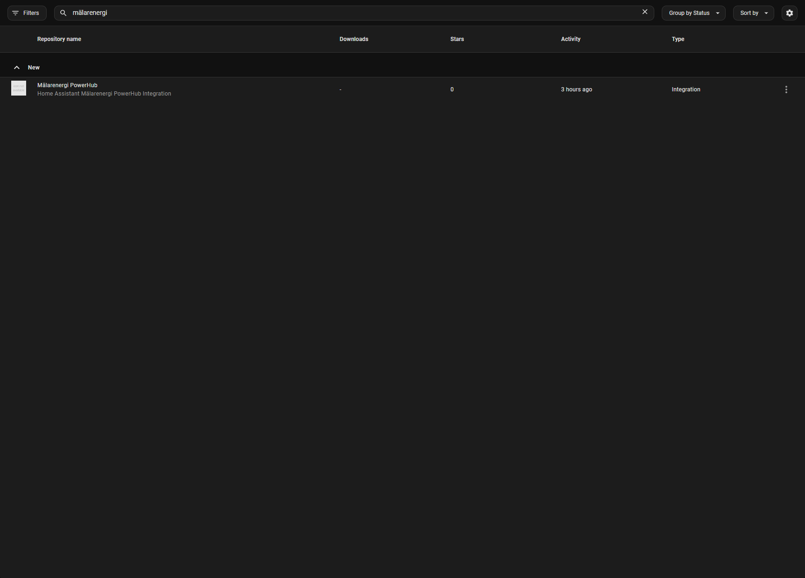

Click the result to open the repository page.

---

## Step 3 — Download the integration

1. On the repository page, click **Download** (bottom right)

   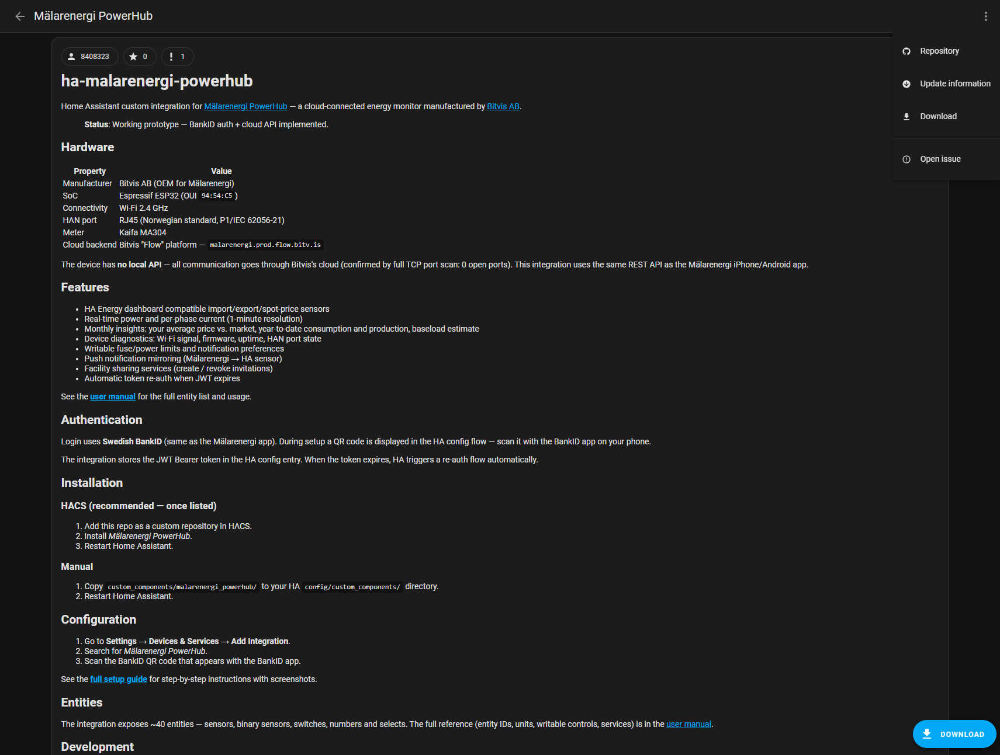

2. Confirm by clicking **Download** in the dialog

---

## Step 4 — Restart Home Assistant

After downloading, Home Assistant must be restarted before the integration becomes available.

1. Go to **Settings → System**
2. Click the **power icon** (top right)
3. Select **Restart Home Assistant** → **Restart**

   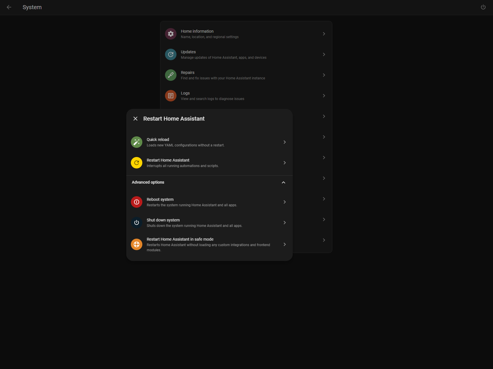

Wait ~30 seconds for Home Assistant to come back online.

---

## Step 5 — Add the integration

1. Go to **Settings → Devices & Services**
2. Click **+ Add integration** (bottom right)
3. Search for **PowerHub**

   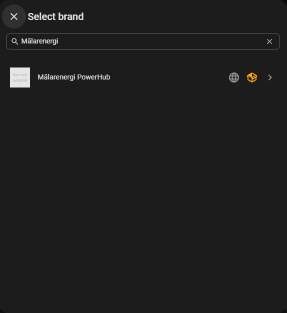

4. Click the result — a setup dialog appears
5. Choose your **energy company** (Mälarenergi, Kraftringen, Boo Energi, …) and click **Submit** — the BankID QR code appears. Not in the list? Type its name in lowercase without spaces, with å/ä/ö as a/a/o (e.g. `norrtaljeenergi`).

---

## Step 6 — Scan the BankID QR code

The integration uses **Swedish BankID** for authentication — the same login as your energy company's PowerHub app.

A QR code is displayed in the dialog:

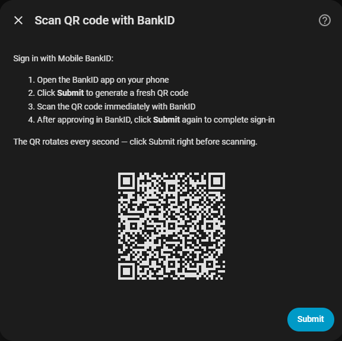

**To authenticate:**

1. Open the **BankID** app on your phone
2. Tap **Scan QR code** (or the QR icon)
3. Point your camera at the QR code on screen
4. **Approve** the login request in BankID
5. Click **Submit** in the dialog to finalise sign-in

> **Note:** The QR code rotates every few seconds. If it expires before you scan it, click **Submit** in the dialog to get a fresh one.
>
> **Be patient after approving:** once you approve in BankID, sign-in can take **1–2 minutes** to complete if the servers are slow. Keep clicking **Submit** every few seconds until the dialog closes — do not re-scan.

---

## Step 7 — Done!

After a successful BankID login, a **PowerHub** device is created under *Settings → Devices & Services → PowerHub*. The two energy sensors below can be used directly in Home Assistant's **Energy dashboard**; the spot price sensor is a monetary sensor (not an Energy-dashboard source, but useful for automations and cost cards):

| Entity | Description | Unit |
|---|---|---|
| `sensor.powerhub_import_today` | Grid import today (midnight → now) — Energy-dashboard compatible | kWh |
| `sensor.powerhub_export_today` | Grid export today (solar) — Energy-dashboard compatible | kWh |
| `sensor.powerhub_spot_price` | Current Nordpool spot price for your region | öre/kWh |

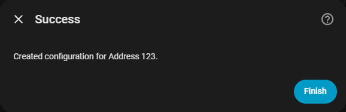

The full entity list — including real-time power, per-phase currents, facility metadata, writable limits, and sharing controls — is documented in [user_manual.md](user_manual.md). Sensors refresh every 60 seconds.

### What the device looks like in Home Assistant

Opening the **PowerHub** device under *Settings → Devices & Services → PowerHub* shows all sensors, configuration entities, and diagnostics:

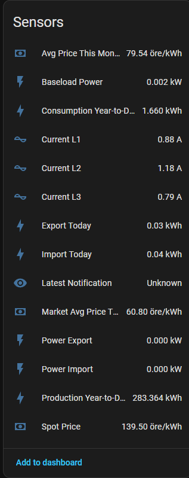

Configuration entities (writable fuse/power limits, facility metadata, notification toggles) are grouped in the **Configuration** section:

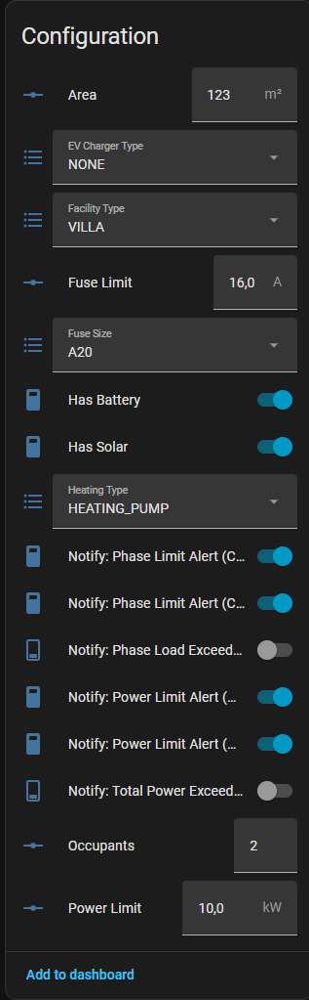

Diagnostic entities (Wi-Fi signal, firmware version, HAN port state, uptime) are grouped in the **Diagnostic** section:

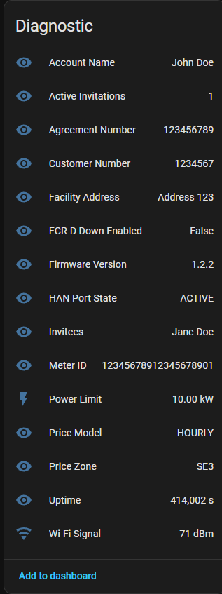

---

## Step 8 — Open the PowerHub dashboard

From v0.4.0 the integration comes with its own dashboard. There is nothing to add: as soon as the integration is set up, **PowerHub** appears in the left sidebar for every user. After **updating** from an older version, first **restart Home Assistant** (the new code only loads on restart), then reload the browser page (on the phone app: pull down to refresh, or restart the app) so it picks up the new sidebar entry.


Open **Settings** in the dashboard (top right) to tick your local sources — solar, home battery, wind, generator/CHP, EV with V2H/V2G, a plain EV charger — and optionally pick sensors for them. Each ticked source appears as its own object in the overview picture, and the grid connection can be shown as an overhead line or an underground cable. Only administrators can change these settings; everyone else sees them read-only. The panel's **Show PowerHub in the sidebar** setting hides it for everyone (it stays reachable at `/powerhub`); to hide it just for yourself, use Home Assistant's own sidebar editing (long-press the sidebar title, or *Profile → Change the order and hide items from the sidebar*).

### Using it together with the built-in Bitvis integration

Home Assistant 2026.10+ ships the [Bitvis Power Hub](https://www.home-assistant.io/integrations/bitvis) integration, which reads the hub locally. The hub pushes its readings over **UDP port 58220**, so the hub and Home Assistant must be on the **same subnet**, or your router must forward that traffic to HA (VLANs and mDNS relays usually block it). When both integrations are set up, the hub shows up as two devices — one local, one cloud — and the panel uses the local real-time values (badge "Live (local)").

---

## Re-authentication

The JWT token issued by BankID expires after some time. When it does, Home Assistant will show a notification:

> *PowerHub — re-authentication required*

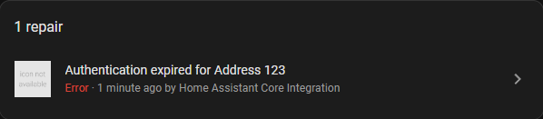

Click the notification and follow the same BankID QR flow to renew your session.

---

## Troubleshooting

**The setup dialog appears blank (no QR code)**
Make sure you have the latest version installed. In HACS, go to the PowerHub page → three-dot menu → **Update information**, then **Redownload**. Restart Home Assistant.

**BankID login fails or times out**
- Ensure your BankID is registered with the same personal identity number as your energy company account
- Close and reopen the BankID app and try again

**"No facilities found" error**
Your energy company account must have an active PowerHub device registered. Contact your energy company if you believe this is incorrect.

**Sensors show 0 kWh**
This is expected early in the day (shortly after midnight) or if your PowerHub has not reported data yet. Values update as the day progresses.
